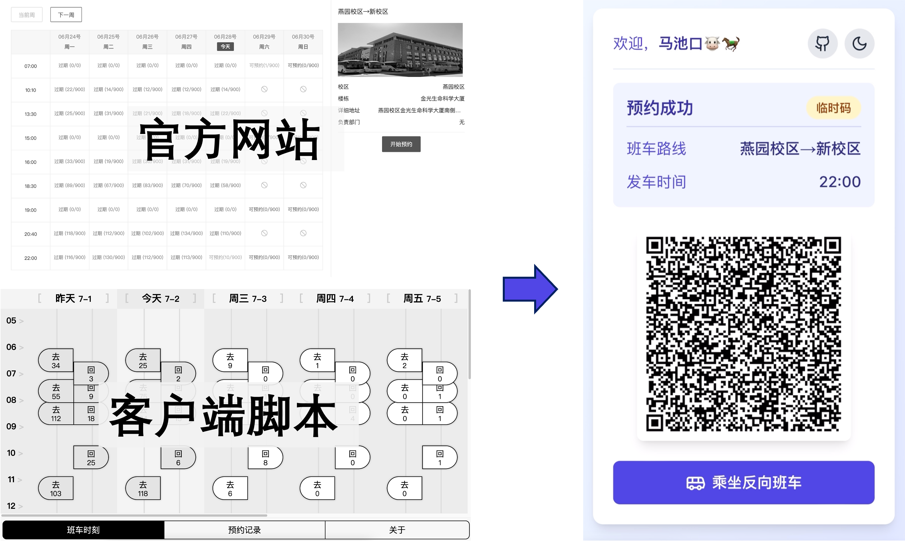

# 三、二、一，马池口！


一键部署你的私有班车预约服务，出示乘车码从未如此优雅。

## 动机

乘坐往返燕园和马池口的班车需要通过官方网站或 APP 进行预约。然而，官方网站的预约流程繁琐，难以找到想要预约的班车。随着基于客户端浏览器的预约脚本（如 [pku-eutopia](https://github.com/xmcp/pku-eutopia)）的开发，预约的流程得到了简化，但仍然需要进行 IAAA 认证，且用户界面具有太多冗余信息。通过官网预约并获取一个乘车码，至少需要在 7 个页面之间进行跳转并点击 6 次屏幕，而 [pku-eutopia](https://github.com/xmcp/pku-eutopia) 也至少需要点击 5 次屏幕。



由于每天两次的预约操作是对心智的无意义消耗，我希望将通过在服务器端进行预约操作，绕开 IAAA，并根据当前时刻智能选择班车预约，将点击屏幕的次数下降到 0，让出示乘车码成为一种优雅的享受。

## 方法

根据当前时间自动选择一个合理的班车，服务端进行预约操作并将乘车码转发给客户端。用户需要在环境变量指定用户名、密码。判断逻辑：

1. 过去 10 分钟内是否有过期的班车，如果有，返回临时码；
2. 否则获取下面最近的一班班车的乘车码。

默认上午约去燕园的车，下午晚上约回昌平的车。即便预约的方向不符合要求，也可以简单地点击“乘坐反向班车”按钮一键切换，切换同时，原有预约会被自动取消。

## 部署

### Vercel 托管（推荐）

1. Fork 本项目。

2. 登录 [Vercel](https://vercel.com/)，授权 Github 仓库读取权限，然后从 fork 的仓库创建新的 project。

3. 设置 Environment variables

**必填**

| 变量名     | 描述                       |
| ---------- | -------------------------- |
| USERNAME   | 学号                       |
| PASSWORD   | 密码                       |
| AUTH_TOKEN | 自定义访问网站时需要的密码 |

Vercel 会自动部署网站。Vercel 免费版的网站是公开可见的，因此需要设置 `AUTH_TOKEN` 保护网页。

<details>
<summary><strong>高级选项</strong></summary>

| 变量名                  | 描述                                                                         | 默认值 |
| ----------------------- | ---------------------------------------------------------------------------- | ------ |
| PREV_INTERVAL           | 向前追溯临时码的时间间隔（分钟）                                             | 10     |
| NEXT_INTERVAL           | 向后检查可乘坐班车的时间间隔（分钟）                                         | 60     |
| CRITICAL_TIME           | 临界时刻，该时刻前后默认的预约班车方向相反（单位为小时，必须是 0-24 的整数） | 14     |
| FLAG_MORNING_TO_YANYUAN | 1 表示临界时刻前去燕园、之后回昌平，0 表示临界时间前回昌平、之后去燕园       | 1      |

默认情况下，只有当前时刻前 10 分钟到后 60 分钟内的班车会被检测。默认 14 点前都前往燕园，14 点后都回昌平。

</details>

### 本地部署

本地部署安全性更高，如果部署在校内，预约耗时将小于 1 秒。

1. 克隆项目到本地

```bash
git clone https://github.com/VariantConst/3-2-1-Marchkov.git && cd 3-2-1-Marchkov
```

2. 安装依赖

首先安装 python（略）和 pnpm

```bash
curl -o- https://raw.githubusercontent.com/nvm-sh/nvm/v0.39.3/install.sh | bash
nvm install 18
nvm use 18
npm install -g pnpm@latest
```

安装 node 依赖

```bash
pnpm install
```

安装 python 依赖

```bash
pip install -r requirements.txt
```

3. 设置环境变量

```bash
cp .env.local.example .env.local
vim .env.local
```

编辑 `.env.local` 文件中的账号密码信息。

4. 启动项目

```bash
pnpm run dev
```

之后访问 `http://localhost:3000` 即可。如果是内网服务器，你后续可能需要通过 Frp、[Cloudflare tunnels](https://www.cloudflare.com/zh-cn/products/tunnel/) 等工具将服务暴露到公网上。
